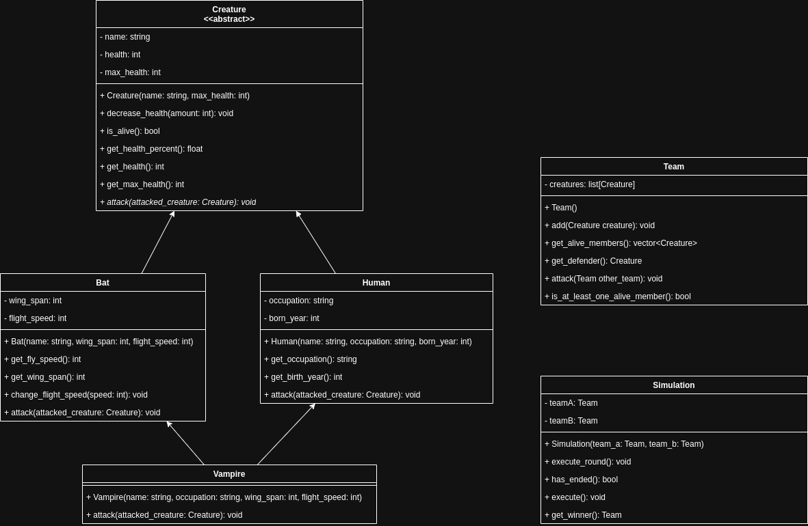

# pjf-lab2-a

Na podstawie ponizszego diagramu UML zaimplementuje klasy:
- Creature
- Human
- Bat
- Vampire
- Team
- Simulation
Dodaatkowe:
- Heal
Modyfikuj wyłącznie plik `solution.py`.


### Dziedzinienie wielobazowe
W diagramie mamy doczynienia z dziedziczeniem wielobazowym, poniewaz klasa Vampire dziedziczy po klasach Human i Bat.

Ważne uwagi:

Kolejność baz ma znaczenie (MRO – Method Resolution Order): Python szuka atrybutów/metod w kolejności od lewej do prawej w nagłówku klasy.

Konstruktory baz w dziedziczeniu wielobazowym nie są wywoływane automatycznie – trzeba je wywołać ręcznie (np. Human.__init__(...) i Bat.__init__(...)) albo świadomie użyć super() zgodnie z MRO.

Przykład:
```class Human:
    def __init__(self, name):
        self.name = name

class Bat:
    def __init__(self, wing_span):
        self.wing_span = wing_span

class Vampire(Human, Bat):
    def __init__(self, name, wing_span):
        Human.__init__(self, name)
        Bat.__init__(self, wing_span)

```
W powyższym przykładzie, konstruktory klas Human i Bat są wywoływane ręcznie w konstruktorze klasy Vampire.

### Dodatkowe założenia

Siła ataku

Bat: 5 pkt
+5 jeśli wing_span > 5
+5 jeśli flight_speed > 5

Human: 10 pkt
100 pkt jeśli occupation == "Soldier"
5 pkt jeśli born_year > 2000

Vampire: 15 pkt

mechanika leczenia (patrz niżej w sekcji 3)

Zdrowie (max i start)

Bat: 40

Human: 100

Vampire: 300

Wszystkie wampiry mają born_year == 1900.

Atak drużyny A na drużynę B polega na tym, że każdy żywy członek drużyny A atakuje członka zwróconego przez metode `get_defender()` drużyny B
W symulacji `execute_round()` polega na tym, że drużyna A atakuje drużynę B, a następnie drużyna B atakuje drużynę A
Metoda `has_ended()` zwraca `True` jeżeli któraś z drużyn nie ma żywych członków
Metoda `execute()` wykonuje rundy symulacji aż do momentu zakończenia

### Mechanika leczenia wampira (leech)
Po udanym ataku wampira:

jeżeli celem był Human i po ataku zdrowie celu spada poniżej 50% (czyli < 50.0),
to wampir leczy się o 10 (ale nie może przekroczyć własnego max_health).

Przykład: Human ma 60/100 HP. Wampir zadaje 15 – Human spada do 45/100 (45%). Warunek spełniony → wampir +10 HP (caps do 300).

### Zasady ataku drużyn i symulacji

Atak drużyny A na B: każdy żywy członek A atakuje obrońcę wybranego przez B.get_defender().
Simulation.execute_round():
A atakuje B,
B atakuje A.
Simulation.has_ended() → True, gdy któraś z drużyn nie ma żywych członków.

Simulation.execute() uruchamia rundy aż do zakończenia.

### Opis testów

test_bat.py – poprawność inicjalizacji nietoperza, zmiana prędkości lotu, obrażenia i logika ataku.
test_human.py – poprawność inicjalizacji człowieka, obrażenia, przypadki ataku: zwykły, żołnierz, młody rocznik.
test_vampire.py – dziedziczenie wielobazowe, inicjalizacja, obrażenia i atak wampira.
test_team.py – operacje na drużynach, wybór obrońcy, atak drużyny.
test_simulation.py – przebieg rund i zakończenie symulacji.
test_heal.py (nowy) – mechanika leczenia wampira:
wampir leczy się o 10, gdy po swoim ataku Human spadnie poniżej 50%,
nie leczy się, gdy celem nie jest Human,
nie leczy się, gdy Human pozostaje ≥ 50% po ataku,
leczenie nie przekracza max_health wampira,
scenariusz sekwencyjny: wiele ataków, wielokrotne leczenie aż do czapki.

### Testy jednostkowe
Testy są podzielone na nastepujące pliki:
- `test_human.py` - za 10pkt
- `test_bat.py` - za 10pkt
- `test_vampire.py` - za 10pkt
- `test_team.py` - za 25pkt
- `test_simulation.py` - za 15pkt
Łącznie 70pkt.

Rozszerzenie (bonus +10 pkt):
test_heal.py – poprawna implementacja mechaniki leczenia wampira.
Razem: 80 pkt (70 + 10 bonus).

Aby uruchomić testy, wpisz w terminalu:
```bash
pytest
```
